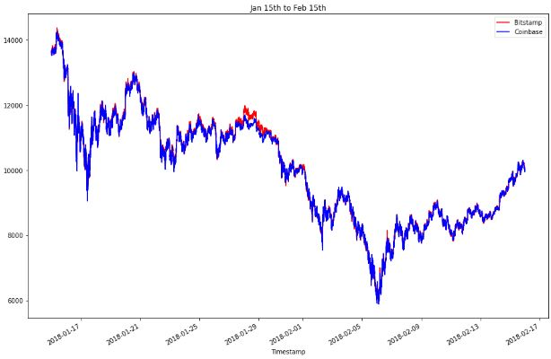
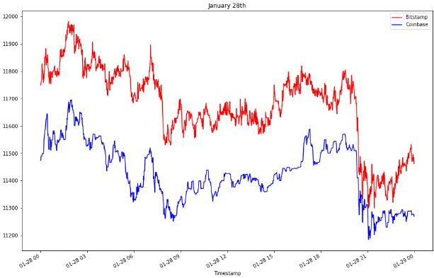
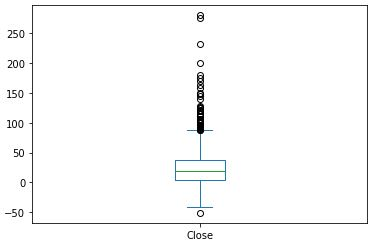
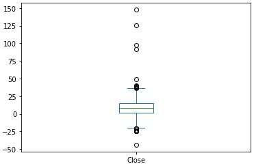

# Module_3_Challenge

This project tracks the closing prices of two exchanges, Bitstamp and Coinbase, from January 1st 2018 to April 1st 2018. With these datasets we look for the best opportunities for arbitrage tradeing during 3 different time frames and calculate the total profits possible for each day.

---

## Technologies

This project uses Python 3.9.7 and the pandas library [Pandas docs](https://pandas.pydata.org/docs/)

---

## Installation Guide

Libraries can be installed with the following commands
```
import pandas as pd

```

---

## Usage

Data has been plotted to show the price differences between the exchanges.

|Dataset Overlay|January 28th|
|---|---|
 |

Box plots were also used to help determine if profitable trades where available for certain time periods.


|February 6th|March 14th
|---|---|
 | 

---

## Contributors

Dan McQueen

dandmcqueen@gmail.com

[Linkedin](https://www.linkedin.com/in/dan-mcqueen-4a5980238/)

---

## License

[GNU v3.0](GNU_License.txt)
